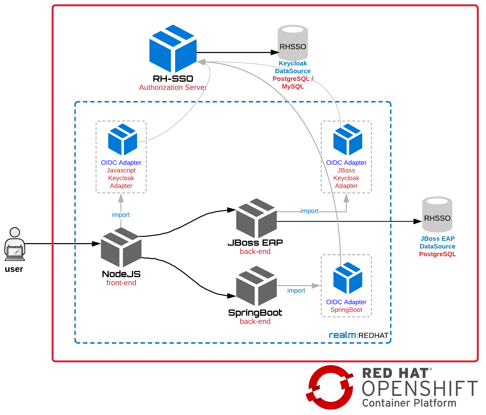
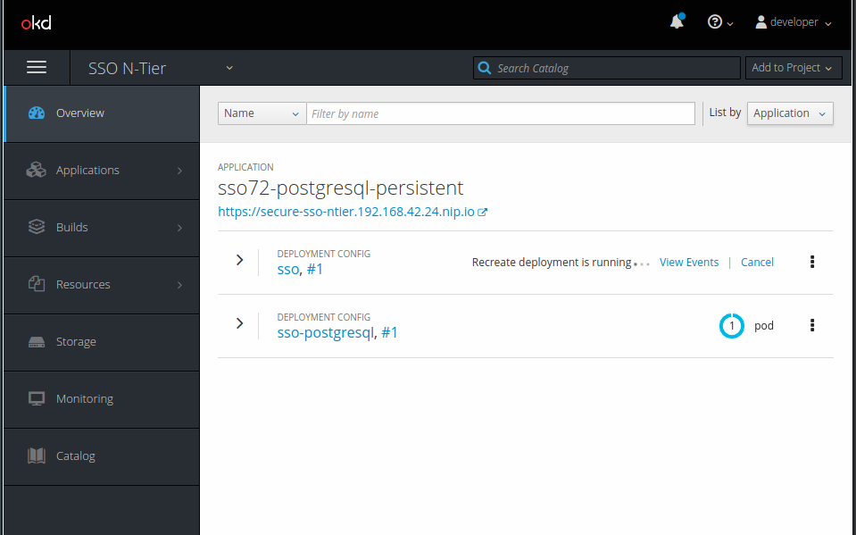
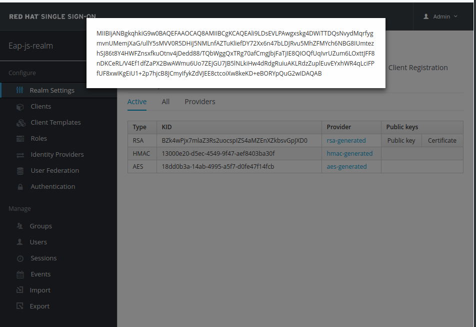
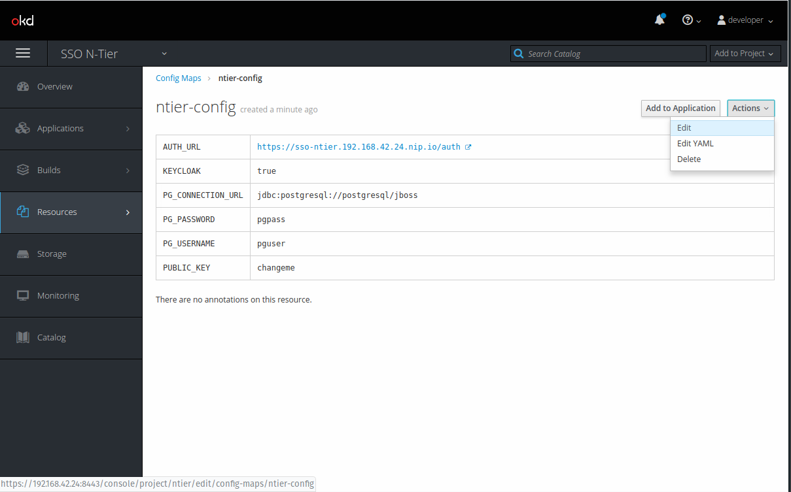
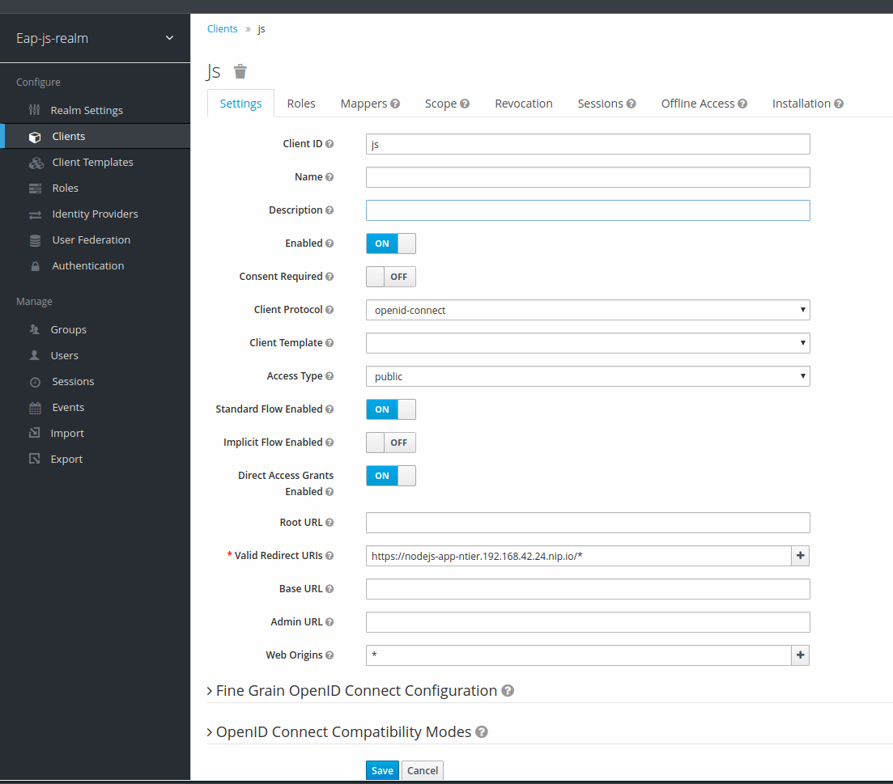
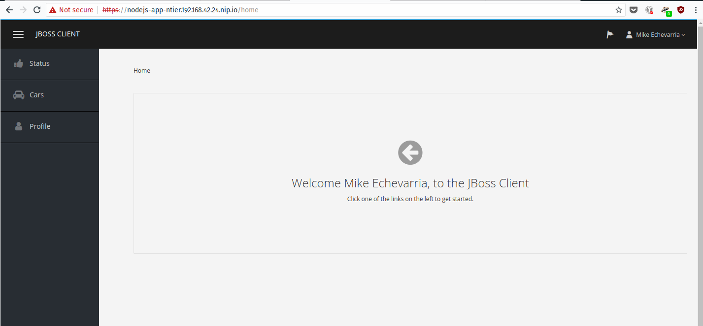

# Red Hat Openshift Single Sign-On Secured N-tier application

```
#nodejs #java #eap #openshift #security #keycloak #oidc #redhat
```

Este projeto contém scripts e códigos-fonte para implantar uma aplicação de 3 camadas utilizando o [Red Hat Single Sign-On](https://access.redhat.com/products/red-hat-single-sign-on) e protegendo-a com SSL.

A aplicação é distribuída em uma app frontend (tier 1) [node.js](https://nodejs.org/en/) + [angular](https://angular.io/) que realiza a chamada para uma app back-end REST (tier 2) [springboot](http://spring.io/projects/spring-boot) e uma app back-end REST (tier 2) [JBoss EAP](https://access.redhat.com/products/red-hat-jboss-enterprise-application-platform/) que irá persistir em uma instância de banco de dados (tier 3) [postgresql](https://www.postgresql.org/).

A implantação do Red Hat Single Sign-On irá atuar na proteção deste cenário através de uma realm chamada **java-js-realm**. A realm irá conter clients configurados para o público que enxergam o frontend (js) e o back-end do tipo bearer only (eap). O objetivo deste cenário é simples e se trata apenas de garantir que **um usuário válido está devidamente logado**.

Todos os scripts que irão auxiliar o deployment das aplicações requerem que você já esteja devidamente autenticado utlizando o cli da instância do cluster openshift [oc](https://docs.openshift.com/container-platform/3.10/cli_reference/get_started_cli.html) [openshift](https://www.openshift.com/) ou [minishift](https://www.okd.io/minishift/)

Exemplo: `oc login -u developer`



## Deploy Red Hat Single Sign-On

Navegue para o diretório `sso` e execute o script `ocp-deploy-sso.sh`.<br>
Uma vez finalizado a execução você irá visualizar os pods criados no projeto **SSO N-tier**.

Os dados para login do console administrativo do RH-SSO são **admin/Redhat1!**

**OBS**. Talvez seja necessário importar as imagens oficiais do Red Hat Single Sign-On caso não existam no registry do OCP. Para isso, execute o script `ocp-install-templates.sh` que se encontra no diretório de instalação `sso`.



Caso já existam, os templates poderão ser substituídos pelos novos que se encontram no repositório do github, atualmente no endereço [RH-SSO Templates](https://github.com/jboss-container-images/redhat-sso-7-openshift-image/tree/sso72-dev/templates)

### Set the Public Key in the config map

Certifique-se que a instância do RH-SSO está ativa (running). Uma vez que a instância estiver UP você irá precisar modificar o [config map](https://docs.openshift.com/container-platform/3.10/dev_guide/configmaps.html) utilizado pelo back-end do JBoss EAP para se comunicar com o Red Hat Single Sign-On.

* Acesse o console administrativo do RH-SSO. As credenciais para acesso são **admin/Redhat1!**

* No **console administrativo do RH-SSO**, navegue para a **java-js-realm**, na aba **keys** e selecione **Public Key** na chave **RSA** e guarde o valor gerado na popup em um bloco de notas para utilização futura.



* Retorne para o console administrativo do Openshift.<br>No projeto **SSO N-Tier**, navegue para **Resources** e depois em **Config Maps**

* Edite o config-map **ntier-config** e copie o valor previamente copiado no bloco de notas para a entrada **PUBLIC_KEY** (previamente definido com o valor **changeme**)



## Deploy JBoss EAP and Postgresql

Navegue para o diretório `eap` e execute o script `ocp-deploy-eap.sh`.<br>
Este script irá criar a aplicação de back-end **bearer-only** que irá fazer uso do banco de dados PostgreSQL. 

## Deploy Spring Boot

Navegue para o diretório `springboot` e execute o script `ocp-deploy-springboot.sh`.<br>Este script irá criar a aplicação de back-end **confidential** que servirá as requisições da aplicação de front-end baseada em NodeJS/Angular.

## Deploy node.js

Agora que as camadas tier-2 e tier-3 estão disponíveis, navegue para o diretório `node` e execute o script `ocp-deploy-node.sh`.
Este script irá criar a aplicação front-end **public** baseada em NodeJS que irá realizar a interface final com o usuário e será responsável pelo processo de login/logout integrado ao RH-SSO.

## Configure Clients

Agora que todas as aplicações estão em execução (running), é hora de configurar as aplicações no console administrativo do RH-SSO.<br>
Efetue o acesso ao console administrativo do RH-SSO. 

Lembre-se de utilizar as credenciais **admin/Redhat1!**

### JS Client (front-end)

* Acesse a realm **java-js-realm**, selecione o item de menu **clients**, e acione o botão **create**
* Informe o valor **js** no campo **Client ID**, e clique em **save**
* Informe em **Valid Redirect URIs** a rota que o Openshift criou para a aplicação NodeJS e informe também a URI **/***. Exemplo: `https://nodejs-app-ntier.192.168.42.90.nip.io/*` e `/*`
* Informe o valor `*` em **Web Origins** (Access-Control-Allow-Origin: *). Maiores detalhes sobre CORS poderão ser vistos em [CORS](https://developer.mozilla.org/en-US/docs/Web/HTTP/CORS)  
* Selecione a opção **save**



## Java Client (back-end bearer-only)

* Acesse a realm **java-js-realm**, selecione o item de menu **clients**, e acione o botão **create**
* Informe o valor **java** no campo **Client ID**, e clique em **save**
* Informe a opção **bearer-only** para o campo **Access Type** 
* Selecione a opção **save**
 
## Create User

* Acesse a realm **java-js-realm**, selecione o item de menu **Users**, e acione o botão **Add User**
* Preencha os campos **Username**, **Email**, **First Name** and **Last Name**
* Selecione a opção **save**
* Ainda na página do usuário recém-criado, navegue para a aba **Credentials**, e informe uma nova senha nos campos **New Password** e **Password Confirmation**
* Defina a opção **temporary** para **off**
* Selecione a opção **Reset Password**
* Confirme a operação acionando o botão vermelho **Change the password**

## Test!

Agora que toda a parte de configuração foi realizada, acesse a rota da aplicação **node-js** e se tudo estiver de acordo, você será redirecionado para a página de login provida pela integração da aplicação NodeJS/Angular com o RH-SSO.

Informe o usuário e senha previamente criados.

Ao acessar a aplicação, você será capaz de visualizar os atributos do usuário recém logado no item de menu **Profile**.

Utilizando os itens de menu **Status** e **Cars** você será capaz de realizar chamadas para a aplicação JBoss EAP back-end REST.


